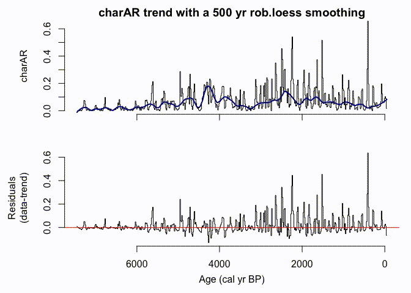
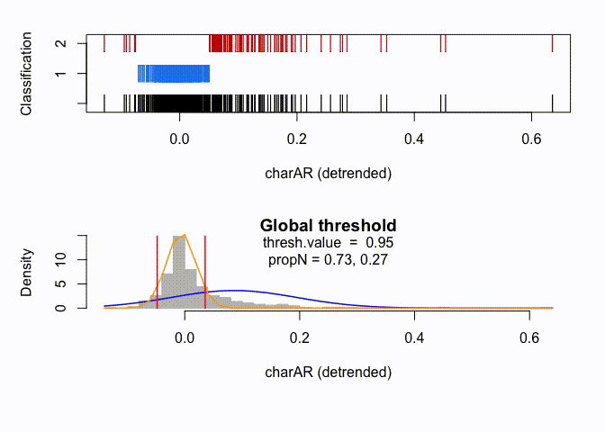
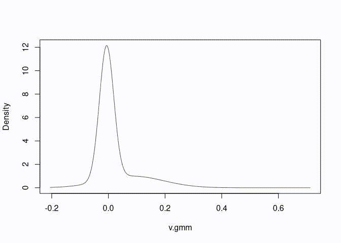
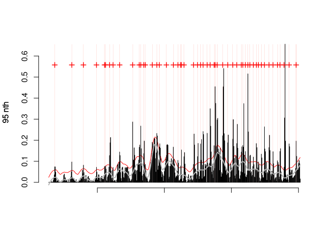
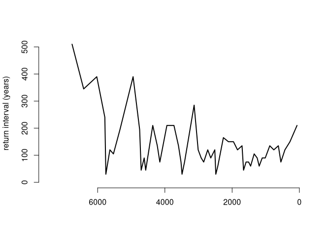

<!-- README.md is generated from README.Rmd. Please edit that file -->

[](https://zenodo.org/badge/latestdoi/421092333)

# ***tapas*** R-package

<!-- badges: start -->
<!-- badges: end -->

## Rationale

The set of functions gathered under the hood of ***tapas*** is meant to
be used for analyzing paleoecological records, when the goal is to
estimate the long-term Trend and detect Peaks to reconstruct the
occurrence, the return intervals, and the magnitude of distinct events.

*tapas* builds on *CharAnalysis*
(<https://github.com/phiguera/CharAnalysis>), a software for analyzing
sediment-charcoal records written in and compiled with Matlab 7.0 by
Phil Higuera (Higuera et al., 2009), with significant input by (amongst
others) Patrick Bartlein (U of OR), Daniel Gavin (U of OR), Jennifer
Marlon, and Ryan Kelly.

Two main reasons led to the development of *tapas*. Firstly, as R is an
open source product, modifying the program to suit individual needs may
be more straightforward. Secondly, an integration and inter-operability
with other existing R-packages may allow using peak-detection analysis
in conjunction with other workflows and types of paleoecological records
(see for instance [(Cagliero et al.,
2021)](https://doi.org/10.1007/s00334-021-00862-x)).

------------------------------------------------------------------------

## Usage

A typical workflow of the peak-detection analysis includes the following
steps [(Higuera et al., 2011)](http://dx.doi.org/10.1071/WF09134):

-   1.) *resample* the record to equally spaced sampling intervals in
    time (years), a procedure also called “binning”
-   2.) *decompose* the resampled record into a long-term trend
    (background component) and peaks (peak component)
-   3.) *screen* the peak component to distinguish signal from noise
    using
    -   3.1 a unique *global* 2-component Gaussian mixture model, or
    -   3.2 *local* 2-component Gaussian mixture models,
    -   3.3 and eventually also screen the peak component using a
        minimum-count test,
-   4.) *evaluate* the suitability of the record for peak-detection
    analysis using the signal-to-noise index [(Kelly et al.,
    2011)](http://dx.doi.org/10.1016/j.yqres.2010.07.011).

*tapas* performs steps 1.) and 2.) for several variables of one dataset
type (e.g. different estimates of charcoal abundance) in one go.
Instead, steps 3.) and 4.) are performed for one user-selected variable.

To run your own data, make a new folder within an umbrella folder, and
save it under a name, e.g., `Data-In`. Then place a file (e.g.,
`MyData.csv`) in that folder. The input data file will contain the
sample depths, sample ages, sample volume, and the variable(s). The file
should have the following formatting: It has headers and at least six
fields. The first five columns will report the metadata for the samples,
the subsequent columns contain the variable(s) to be analysed (e.g., the
abundance of charcoal pieces).

| CmTop | CmBot | AgeTop | AgeBot | Volume | variable1 | variable2 | …   | nth-variable |
|-------|-------|--------|--------|--------|-----------|-----------|-----|--------------|
| 0.5   | 1     | -42    | -24    | 3      | 8         | 0.01      | …   | …            |
| 1     | 1.5   | -24    | 5      | 3      | 18        | 0.005     | …   | …            |

The depths and ages should be arranged in ascending order.

Load the data into the R environment

> MyData \<- read.csv(“./Data-In/MyData.csv”)

------------------------------------------------------------------------

## Installation

Install the development version of *tapas* with:

``` r
# library(devtools)
devtools::install_github("wfinsinger/tapas")
```

The `check_pretreat()` function can be used to verify the input data is
formatted correctly. If the samples in the input file are not
contiguous, the `check_pretreat()` function will add rows for the
missing samples. Should the dataset contain samples that were deposited
in a very short amount of time (e.g., slumps, tephras), for which AgeTop
= AgeBot, these samples will be flagged and removed, and a new depth
scale will be created to replace the original one.

> MyData \<- check_pretreat(Mydata)

The functions can either be run individually and step wise, or the
wrapper function `peak_detection()` can be used to perform an analysis
including steps from 1.) to 4.) in one go.

For instance, to analyse the MyData data set for variable1:

> MyData_peaks \<- peak_detection(series = MyData, proxy = “variable1”)

Individual output plots can be generated with dedicated plotting
functions:

> Plot.Anomalies(MyData_peaks, plot.neg = F)

> Plot_ReturnIntervals(MyData_peaks)

Alternatively, the analysis can be done step-by-step (see below for
further details).

------------------------------------------------------------------------

## Example

The package comes with toy data (`co_char_data`) to play with. This is a
macroscopic charcoal record from ([Code
Lake](https://figshare.com/articles/dataset/Higuera_et_al_2009_lake_sediment_pollen_and_charcoal_data/984310/4),
Higuera et al., 2009).

``` r
library(tapas)
co <- co_char_data
```

The dataset can be analysed, for instance, with the following settings
(leaving other arguments with their default values). These are the same
settings used by [Higuera et
al. (2009)](https://doi.org/10.1890/07-2019.1).

``` r
co_loc <- peak_detection(series = co, proxy = "char",
                                first = -51, last = 7500, yrInterp = 15,
                                detr_type = "mov.median", sens = F)
#> [1] "No missing samples detected."
#> [1] "No slumps detected; the age scale is continuous."
```

With these settings, the results obtained using *tapas* strikingly
resemble those obtained by [Higuera et
al. (2009)](https://doi.org/10.1890/07-2019.1) with *CharAnalysis*

Alternatively, the data can be analysed step-by-step:

The first step is to resample the time series with
`pretreatment_data()`:

``` r
co_i <- pretreatment_data(
  series = co, out = "accI", series.name = "co",
  first = -50, last = 7450, yrInterp = 15
)
```

Then, detrend the data with `series_detrend()`:

``` r
co_detr <- SeriesDetrend(
  series = co_i, smoothing.yr = 500,
  detr.type = "rob.loess"
)
```



Fit gaussian mixture models to determine the noise-signal threshold

-   With a Global Threshold (default options):

``` r
char_thresh_gl <- global_thresh(series = co_detr, proxy = "charAR")
```



-   With minimum-count test and removing consecutive peak samples.

``` r
char_thresh_gl <- global_thresh(
  series = co_detr,
  proxy = "charAR",
  thresh.value = 0.95,
  smoothing.yr = NULL,
  keep_consecutive = FALSE,
  minCountP = 0.95,
  MinCountP_window = 150
)
```



Once the analysis is done, plot the result:

``` r
Plot.Anomalies(
  series = char_thresh_gl,
  plot.crosses = TRUE,
  plot.x = FALSE,
  plot.neg = FALSE
)
```



And plot the Return Intervals:

``` r
Plot_ReturnIntervals(
  series = char_thresh_gl,
  plot.x = TRUE,
  plot.neg = FALSE
)
```



------------------------------------------------------------------------

## Details

A typical workflow of the peak-detection analysis includes the following
steps [(Higuera et al., 2011)](http://dx.doi.org/10.1071/WF09134):

-   1.) *resampling* the record to equally spaced sampling intervals in
    time (years) is performed using the `pretreatment_data()` function,
    which loops the `paleofire::pretreatment()` function for all
    variables in the input data frame. The user can choose among the
    following output data types:
    -   resampled accumulation rates (out = “accI”; default),
    -   resampled concentrations (out = “conI”), or
    -   resampled input data (e.g., if variable1 in the input is
        charcoal counts, with out = “countI” one gets resampled counts).
-   2.) *decomposition* of the resampled record into a long-term trend
    (background component) and peaks (peak component) is performed with
    the `SeriesDetrend()` function for all variables in the input data
    frame. The user can select the smoothing-window width (in years) as
    well as the type of the detrending (e.g. `detr.type = "rob.loess"`).
    Currently, the following functions are implemented to smooth the
    temporal series:
    -   robust loess (“rob.loess”),
    -   robust Lowess (“rob.lowess”), and
    -   moving median (“mov.median”; aka Method \#4 in CharAnalysis’
        Matlab version);
-   3.1) *screen* the peak component to distinguish signal from noise
    using one or more 2-component Gaussian mixture models that are
    determined using the `mclust` R package [Scrucca et al.,
    2016](https://doi.org/10.32614/RJ-2016-021).
    -   a unique *global* 2-component Gaussian mixture model
        (`Global_Thresh()`), or
    -   several *local* 2-component Gaussian mixture models
        (`Local_Thresh()`);
-   3.2) and eventually also *screen* the peak component using a
    minimum-count test. This part of the `Global_Thresh()` and
    `Local_Thresh()` functions was translated verbatim from
    *CharAnalysis*.
-   4.) *evaluate* the suitability of the record for peak-detection
    analysis using the signal-to-noise index [SNI; R code from
    Supplementary Material to Kelly et al.,
    2011](http://dx.doi.org/10.1016/j.yqres.2010.07.011).
-   5.) Diagnostic plots showing the sensitivity to different
    smoothing-window widths are produced with the `peak-detection()`
    function if the function’s argument `sens=TRUE`.

Since v0.1.2, a GAM-modeled trend can be used as well for the
*decomposition* step, though the procedure is a little bit more tedious,
as it is not implemented in the `peak_detection()` wrapper function: -
if the data was *resampled*, use the `tapas2mgcv()` function to extract
the data stored in the list generated with the `pretreatment_data()`
function. Then model the trend using the `mgcv::gam()` function, and
translate the `mgcv::gam()`-generated list using the `mgcv2tapas()`
function. Then move on to the *screening* step. - if the data wasn’t
*resampled*, simply omit the `tapas2mgcv()` step.

------------------------------------------------------------------------

## Credits & Acknowledgements

The development of this set of functions would not have been possible
without the Matlab-coded templates that were written and made open
source by Philip Higuera (<https://github.com/phiguera/CharAnalysis>),
whose features were also based on the programs CHAPS, by Patrick
Bartlein (U of OR), and Charster, by Daniel Gavin (U of OR), and on the
Gaussian mixture model by Charles Bouman (Purdue), and benefited from
discussions with and testing by members of the Whitlock Paleoecology Lab
at Montana State University, Dan Gavin, and Ryan Kelly.

We are thankful to Dan Gavin for suggesting tweaks to accomodate for
non-standard data-input formats for *tapas*. His suggestions led to the
`check_pretreatment()` function. Petr Kunes and several CharAnalysis
users who ignited the conversation over the past few years about getting
that program into R are greatly thanked.

If you use *tapas* in your publication, please cite it as follows:
Finsinger W., Bonnici I. (2022) - *tapas*: an R package to perform trend
and peaks analysis. *<https://doi.org/10.5281/zenodo.6344463>* and any
non-default settings applied.

------------------------------------------------------------------------

## Issues & Contributions

If you are having problems running *tapas* or if you have any
suggestions, please use the “Issues” tab. Contributions to this work are
more than welcome. *tapas* is meant as a flexible data-analysis
environment, just as its real-world counterpart that is based on a “pick
& choose sides” philosophy. Thus, feel free to fork, make changes, and
then file a pull request. Alternatively, get in touch to discuss how
your improvements may fit with ongoing development of add-ons. Thanks!

------------------------------------------------------------------------

## References

> Cagliero E, Morresi D, Paradis L, Curović M, Spalević V, Marchi N,
> Meloni F, Bentaleb I, Motta R, Garbarino M, Lingua E, Finsinger W
> (2022) Legacies of past human activities on one of the largest
> old-growth forests in south-east European mountains. *Vegetation
> History and Archaeobotany*, online available
> [link](https://doi.org/10.1007/s00334-021-00862-x).

> Higuera PE, LB Brubaker, PM Anderson, FS Hu, TA Brown (2009)
> Vegetation mediated the impacts of postglacial climatic change on fire
> regimes in the south-central Brooks Range. *Alaska Ecological
> Monographs* 79: 201-219 [link](https://doi.org/10.1890/07-2019.1)

> Higuera PE, Gavin DG, Bartlein PJ, Hallett DJ (2010) Peak detection in
> sediment–charcoal records: impacts of alternative data analysis
> methods on fire-history interpretations. *International Journal of
> Wildland Fire* 19: 996. [link](http://dx.doi.org/10.1071/WF09134)

> Kelly RF, PE Higuera, CM Barrett, FS Hu (2011) A signal-to-noise index
> to quantify the potential for peak detection in sediment-charcoal
> records. *Quaternary Research* 75: 11-17
> [link](http://dx.doi.org/10.1016/j.yqres.2010.07.011)

> Scrucca L, Fop M, Murphy TB, Raftery AE (2016) mclust 5: clustering,
> classification and density estimation using Gaussian finite mixture
> models. *The R Journal* 8: 289-317
> [link](https://doi.org/10.32614/RJ-2016-021)
